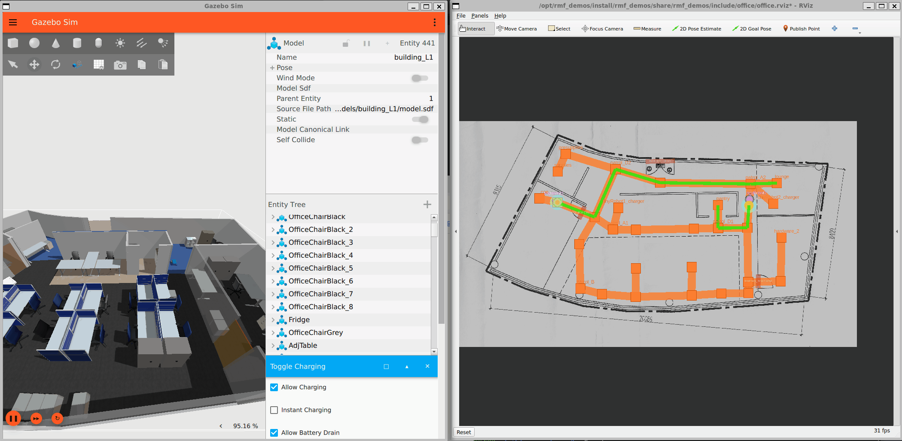

# open-rmf-sandbox

Open-RMFのデモをDevContainer上で動くようにしたものです。ROS 2のバージョンはjazzyになります。

- [open\-rmf/rmf\_demos: Demonstrations of the Open\-RMF](https://github.com/open-rmf/rmf_demos)

[Demo Worlds](https://github.com/open-rmf/rmf_demos?tab=readme-ov-file#demo-worlds) の、Hotel World と Office World が動作することを確認しています。

```
# Office World
ros2 launch rmf_demos_gz office.launch.xml

# tasks
ros2 run rmf_demos_tasks dispatch_delivery -p pantry -ph coke_dispenser -d hardware_2 -dh coke_ingestor --use_sim_time
ros2 run rmf_demos_tasks dispatch_patrol -p coe lounge -n 3 --use_sim_time
```



セットアップの内容は、 [.devcontainer/Dockerfile](.devcontainer/Dockerfile) をご参照ください。

## そのままだと動かなかった部分

GitHubのREADMEにある情報だけではエラーが出てしまって修正した部分になります。

### (1) Unable to find uri[model://Open-RMF/CleanerBotA]

```
[gz-20] [Err] [Server.cc:86] Error Code 14: [/sdf/world[@name="sim_world"]/include[61]/uri:/opt/rmf_demos/install/rmf_demos_maps/share/rmf_demos_maps/maps/hotel/hotel.world:L815]: Msg: Unable to find uri[model://Open-RMF/CleanerBotA]
[gz-20] [Err] [Server.cc:86] Error Code 14: [/sdf/world[@name="sim_world"]/include[62]/uri:/opt/rmf_demos/install/rmf_demos_maps/share/rmf_demos_maps/maps/hotel/hotel.world:L820]: Msg: Unable to find uri[model://Open-RMF/CleanerBotA]
[gz-20] [Err] [Server.cc:86] Error Code 14: [/sdf/world[@name="sim_world"]/include[63]/uri:/opt/rmf_demos/install/rmf_demos_maps/share/rmf_demos_maps/maps/hotel/hotel.world:L825]: Msg: Unable to find uri[model://Open-RMF/TinyRobot]
[gz-20] [Err] [Server.cc:86] Error Code 14: [/sdf/world[@name="sim_world"]/include[64]/uri:/opt/rmf_demos/install/rmf_demos_maps/share/rmf_demos_maps/maps/hotel/hotel.world:L830]: Msg: Unable to find uri[model://Open-RMF/DeliveryRobot]
```

実際は`rmf_demos_assets/share/rmf_demos_assets/models`配下に存在する(`Open-RMF`を挟まない)ので、`Open-RMF`フォルダを作ってそこにリンクを張っておく。

```
cd /opt/rmf_demos/install/rmf_demos_assets/share/rmf_demos_assets/models/
mkdir Open-RMF
cd Open-RMF
ln -s ../Caddy ./Caddy
ln -s ../CleanerBotA ./CleanerBotA
ln -s ../CleanerBotE ./CleanerBotE
ln -s ../DeliveryRobot ./DeliveryRobot
ln -s ../HospitalRobot ./HospitalRobot
ln -s ../RobotPlaceholder ./RobotPlaceholder
ln -s ../TeleportDispenser ./TeleportDispenser
ln -s ../TeleportIngestor ./TeleportIngestor
ln -s ../TinyRobot ./TinyRobot
```

### (2) Failed to load system plugin

```
[gz-20] [Err] [SystemLoader.cc:92] Failed to load system plugin [libdoor.so] : Could not find shared library.
[gz-20] [Err] [SystemLoader.cc:92] Failed to load system plugin [liblift.so] : Could not find shared library.
[gz-20] [Err] [SystemLoader.cc:92] Failed to load system plugin [libslotcar.so] : Could not find shared library.
[gz-20] [Err] [SystemLoader.cc:92] Failed to load system plugin [libslotcar.so] : Could not find shared library.
[gz-20] [Err] [SystemLoader.cc:92] Failed to load system plugin [libslotcar.so] : Could not find shared library.
[gz-20] [Err] [SystemLoader.cc:92] Failed to load system plugin [libslotcar.so] : Could not find shared library.
[gz-20] [Err] [SystemLoader.cc:92] Failed to load system plugin [libregister_component.so] : Could not find shared library.
[gz-20] [Err] [SystemLoader.cc:92] Failed to load system plugin [libregister_component.so] : Could not find shared library.
[gz-20] [Err] [SystemLoader.cc:92] Failed to load system plugin [libregister_component.so] : Could not find shared library.
[gz-20] [Err] [SystemLoader.cc:92] Failed to load system plugin [libregister_component.so] : Could not find shared library.
[gz-20] [Err] [SystemLoader.cc:92] Failed to load system plugin [libregister_component.so] : Could not find shared library.
```

`GZ_SIM_SYSTEM_PLUGIN_PATH`でSystemプラグインのパスを設定。

```
export GZ_SIM_SYSTEM_PLUGIN_PATH=/opt/ros/jazzy/lib/rmf_robot_sim_gz_plugins:$GZ_SIM_SYSTEM_PLUGIN_PATH
export GZ_SIM_SYSTEM_PLUGIN_PATH=/opt/ros/jazzy/lib/rmf_building_sim_gz_plugins:$GZ_SIM_SYSTEM_PLUGIN_PATH
```

### (3) Failed to load plugin

```
[gz-16] [GUI] [Err] [Application.cc:545] Failed to load plugin [toggle_charging] : couldn't find shared library.
[gz-16] [GUI] [Err] [Application.cc:545] Failed to load plugin [toggle_floors] : couldn't find shared library.
```

`GZ_GUI_PLUGIN_PATH`でGUIプラグインのパスを設定。

```
export GZ_GUI_PLUGIN_PATH=/opt/ros/jazzy/lib/rmf_building_sim_gz_plugins:$GZ_GUI_PLUGIN_PATH
```
